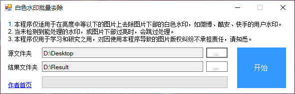
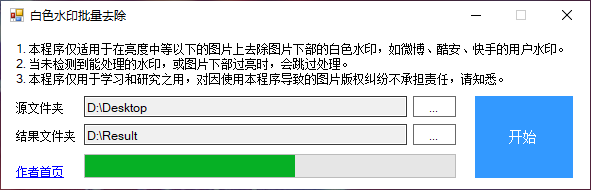
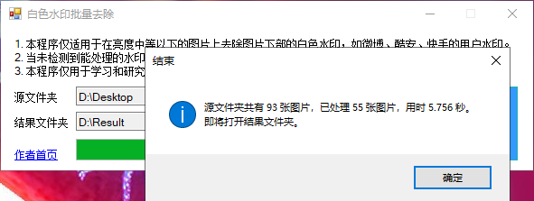

# SimpleBatchWatermarkRemoval
移除图片下部的白色水印。

## 一 / 原理
在图片下部扫描寻找 RGB 值偏高的区域（这也导致本程序不适合处理亮度较高的图片），绘制修复模板，为了水印边缘效果更佳，需要先膨胀，之后调用图像修复函数进行修复。

## 二 / 要求
- 依赖：OpenCvSharp4
- 格式：.jpg, .jpeg, .png

## 三 / 用法
1. 通过以下途径获取 `SimpleBatchWatermarkRemoval.exe` 。
  - 下载本项目，使用 Visual Studio 编译生成。
  - 或在本项目 [_Output](_Output) 中下载。
  - 或在 [Releases](https://github.com/Roy0309/SimpleBatchWatermarkRemoval/releases) 中下载。
    
2. 运行 `SimpleBatchWatermarkRemoval.exe` 。
  - 双击运行 `SimpleBatchWatermarkRemoval.exe` 。
  - 选择要处理的图片文件夹，会自动将结果文件夹指向其父目录中的 `Result` 文件夹。
  - （可选）选择结果文件夹路径。
  - 点击开始，等待结果。处理后的图片与源图片同名。

### 提示
1. 因图片格式不支持、图片下部过亮、未找到水印等原因，处理过的图片数量可能少于源图片数。
2. 在结果文件夹路径未改变的情况下，多次点击开始，会覆写结果文件夹的文件，可能会被杀毒软件当成勒索病毒。因此可手动删除已生成的结果文件夹内容，或修改结果文件夹路径，或忽视该警告。

## 四 / 输出

1. 运行 `SimpleBatchWatermarkRemoval.exe` 后选择源图片文件夹。  

2. 点击开始，正在处理中。  

3. 处理完成，点击确定后打开结果文件夹。  

4. 部分样张（原图来自网络，与本程序无关，仅作示范）。  
   
   
 

